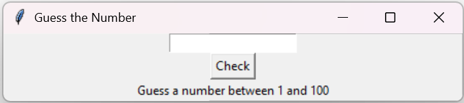

# 🎯 Number Guessing Game (with GUI)

A fun and interactive **Number Guessing Game** built using **Python** and **Tkinter**.
---

## 📌 Features

* 🎲 Random number generation between **1–100**
* ⚡ Instant feedback (*Too High / Too Low*)
* 🔄 Automatic restart after correct guess
* 🎨 Simple and interactive **GUI** with Tkinter

---

## 🖼️ Screenshot



---

## 🛠️ Tech Stack

* **Python 3** 🐍
* **Tkinter** 🎨 (for GUI development)

---

## 🚀 How to Run the Game

Run the script:

   ```bash
   python num_guess.py
   ```

## 🎯 Learnings

* 🐍 Strengthened Python fundamentals
* 🎨 Built an interactive GUI using Tkinter
* 🔧 Implemented reset and logic handling for a better user experience

---

## 🙌 Acknowledgement

This project was completed as part of my **Internship journey at Alfido Tech** 💼🌟
